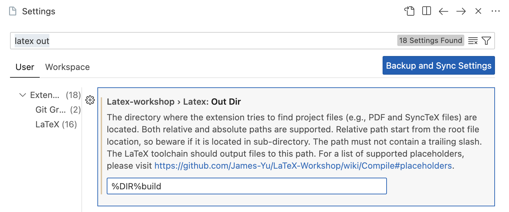
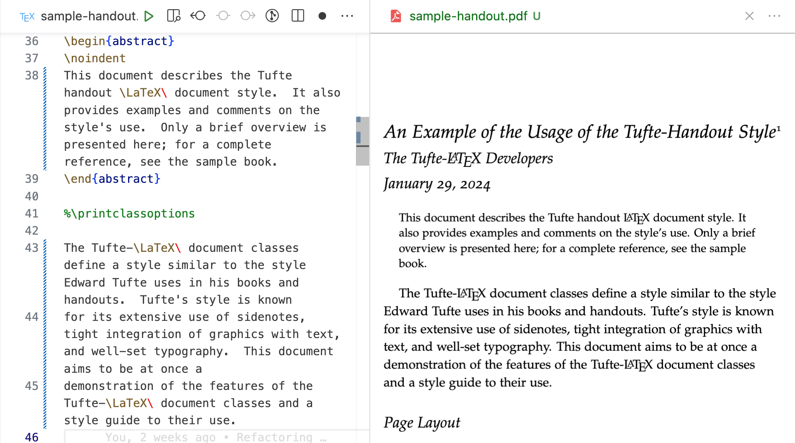

<p align="center">
  <a href="https://github.com/destin-v">
    
  </a>
</p>

# 📒 Description
<p align="center">
  
</p>

LaTeX templates designed to be used with **VsCode** and **LaTeX Workshop** extension.  This design template keeps all LaTeX files in a common folder but builds in a different `build` folder.  Graphics are held in the `graphics` folder.  Most LaTeX templates dump their temporary files in the same folder as the source code creating clutter.  This design template imposes organization on your LaTeX files.

# Installation

Install the following:

* [**VsCode**](https://code.visualstudio.com/download)
* [**TexLive**](https://tug.org/texlive/)
* [**LaTeX Workshop extension**](https://marketplace.visualstudio.com/itemdetails?itemName=James-Yu.latex-workshop)

LaTeX indent is used as the formatter.  You will need to install it using Homebrew:
```console
brew install latexindent
```

# LaTeX Workshop Configuration
In the VsCode settings search for `latex out` and edit the path to `%DIR%build`.  This will construct a new directory when building temporary files.  The final PDF will be located in the new directory.

<p align="center">
  
</p>

# Use
The `.vscode`/**settings.json** is configured to automatically format your LaTeX files every time you hit save (`⌘`+`S`).  LaTeX workshop will re-build the PDF when executing a save command.  Have a tab open of your PDF while editing to synchronize your writing process.  Make sure to use `git` to track changes while you write!

---

<p align="center">
  
</p>

---

# Troubleshooting
To manually format a LaTeX open a terminal and enter:
```console
latexindent <name>.tex
```

To manually sort and align BibTex files use the command:
* `⌘`+`Shift`+`P` --> **Latex Workshop: Sort and Align BibTex**


# References
* Tufte-LaTeX (2024, Jan 18). *GitHub Pages*.  http://tufte-latex.github.io/tufte-latex/

* Carlos Pinzón (2024, Jan 18). Save auxiliary Latex files in another folder in VSC.  *StackExchange.* https://tex.stackexchange.com/questions/525604/save-auxiliary-latex-files-in-another-folder-in-vsc.
